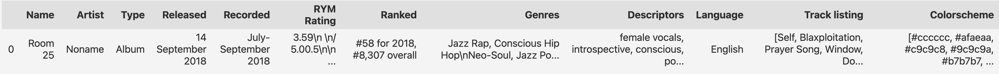
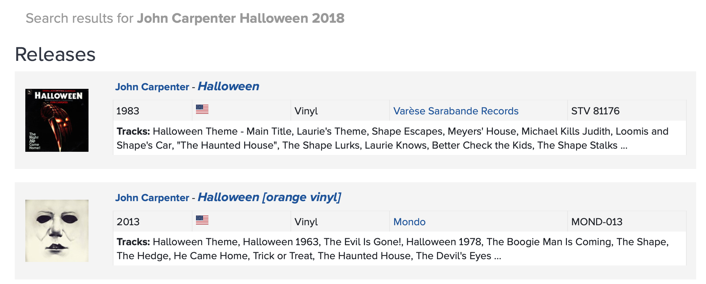

```{r setup, include=FALSE}
# this prevents package loading message from appearing in the rendered version of your problem set
knitr::opts_chunk$set(warning = FALSE, message = FALSE)
library(openintro)
library(tidyverse)
library(mi)
library(redav)
```

# Data 

## Sources

We first scrapped album ratings from [Metacritic](https://metacritic.com), a famous and reliable website that aggregates reviews and ratings for music albums. We scrapped the critic ratings for albums released between 2018 and 2022(inclusive) and concatenate them to one table.

Based on the albums and artist name we got from the Metacritic website, we collected the user rating of corresponding albums from [Rate Your Music (RYM)](https://rateyourmusic.com), which is the largest community-driven online music database. To be specific, we query each albums by its name and artist through an unofficial API [rymscraper](https://github.com/dbeley/rymscraper).

For the user popularity of each album, we collect popularity from [Spotify official APIs](https://developer.spotify.com/documentation/web-api/reference/#/operations/get-track). Since Spotify provides the popularity of each track in an album, we records the avg, mean, median, and max popularity of all tracks in a album for each album.

Additionally, we also collect the features of all songs that appears in the album that we collected before. That is, we have a new table to save the duration, name, popularity, acousticness, danceability, energy, instrumentalness, key, liveness, loudness, mode, speechiness, tempo, time_signature and valence of each song/track.

Because the raw data is not so clean and showing them directly would be a disaster, we prefer introduce the types of variables and other information of these data set during&after cleaning and transformation. :)

## Cleaning / transformation

### Metacritic Data

As we can see from below, the raw data we scrapped from the [Metacritic](https://metacritic.com), it is not so clean. The data doesn't have proper column name and some columns are useless in the following analysis. And more importantly, the data type of all columns are characters. Thus, before analyzing, we did data cleaning to the Metacritic data set:

1. Delete useless columns: V6, V8, V9 are useless because of either containing duplicate data or having long text that is not helpful.
2. Rename left columns: according to the meaning of each row, we rename the columns as "Metacritic_Score", "Rank", "Album_Name", "Singer", "Release_Date", "Description", "User_Score", "Release_Year"
3. Transform the data
  - Metacritic_Score & Rank: transform them from type char to type int for future analysis.
  - Singer: contains redundant characters "by ", e.g. "by Fiona Apple". Extract only the artist name, e.g. "Fiona Apple"
  - User_Score: transform is from type char to type float for future analysis.
  - Release_Date: it is originally in char type, e.g. "April 17, 2020". Transform it to R datetime type, e.g. 2020-04-17
  - id: for future usage(joining different dataframe)

```{r}
library(rvest)
url = "https://www.metacritic.com/browse/albums/score/metascore/year/filtered?view=condensed&year_selected=2020&sort=desc&page=0"

get_data_from_url <- function(url) {
  # get the lines of the table
  lines <- url %>%
    read_html() %>%
    html_nodes(xpath = "//table") %>%
    html_nodes(xpath = "tr")

  # define the empty table
  ncol <- lines %>%
    .[[1]] %>%
    html_nodes("span, h3, div") %>%
    length()
  nrow <- length(lines)
  table <- as.data.frame(matrix(nrow = nrow, ncol = ncol))

  # fill the table
  for (i in 1:nrow) {
    # get content of the line
    linecontent <- lines[[i]] %>%
      html_nodes("span, h3, div") %>%
      html_text() %>%
      gsub("\n", "", .) %>%
      trimws()

    # attribute the content to free columns
    colselect <- is.na(table[i, ])
    table[i, colselect] <- linecontent

    # get the line repetition of each columns
    repetition <- lines[[i]] %>%
      html_children() %>%
      html_attr("rowspan") %>%
      ifelse(is.na(.), 1, .) %>% # if no rowspan, then it is a normal row, not a multiple one
      as.numeric()

    # repeat the cells of the multiple rows down
    for (j in 1:length(repetition)) {
      span <- repetition[j]
      if (span > 1) {
        table[(i + 1):(i + span - 1), colselect][, j] <- rep(linecontent[j], span - 1)
      }
    }
  }

  return(table)
}

sample = get_data_from_url(url)
head(sample)
```

After transformation and cleaning, the Metacritic data contains 2275 observations of 9 different variables.


| Variable Name    | Data Type | Meaning                     |
|------------------|-----------|-----------------------------|
| id               | int       | album id                    |
| Metacritic_Score | int       | critic rating on Metacritic |
| Rank             | int       | rank in release year        |
| Album_Name       | chr       | album name                  |
| Singer           | chr       | album artist                |
| Release_Date     | Datetime  | album release date          |
| Description      | chr       | album description           |
| User_Score       | num       | album user score            |
| Release_Year     | int       | album release year          |

### Rate Your Music

As we can see from the snapshot of the description of sample album of the raw data we collected from [Rate Your Music (RYM)](https://rateyourmusic.com), the data is messy. Before conducting merging, data need cleaning and transformation.

1. Delete useless columns: Type, Recorded are useless because they contain duplicate data.
2. New column: We found that "RYM Rating" is in charcter type and contains not only ratings but also number of people who rate the album. Therefore, we extract the number of ratings and create a new column named "Num_of_RYM_Ratings"
3. Transform the data
  - Released: it is originally in char type, e.g. "14 September 2018". Transform it to R datetime type, e.g. 2018-09-14
  - RYM Rating: Extract ratings from characters and change the data type to numerate.
  - id: for future usage(joining different dataframe)
  - reserve the left data and transform them in the future if needed.



After transformation and cleaning, the RYM data contains 2275 observations of 13 different variables.

| Variable Name      | Data Type | Meaning                            |
|--------------------|-----------|------------------------------------|
| id                 | int       | album id                           |
| RYM.Rating         | int       | user rating on RYM                 |
| Ranked             | chr       | rank in release year               |
| Name               | chr       | album name                         |
| Artist             | chr       | album artist                       |
| Released           | Datetime  | album release date                 |
| Descriptors        | chr       | album description                  |
| Track.listing      | chr       | tracks in album                    |
| Release_Year       | int       | album release year                 |
| Genres             | chr       | album genre                        |
| Language           | chr       | song language                      |
| Colorscheme        | chr       | album colorscheme                  |
| Num_of_RYM_Ratings | int       | number of users who rate the album |


### Spotify

The data we get from [Spotify official APIs](https://developer.spotify.com/documentation/web-api/reference/#/operations/get-track) is quite clean. Thus we will directly introduce the variables.

The album data set contains 2275 observations of 6 different variables.

| Variable Name | Data Type | Meaning                                        |
|---------------|-----------|------------------------------------------------|
| id            | int       | album id                                       |
| avg_pop       | num       | average popularity of all tracks in this album |
| max_pop       | int       | max popularity among all tracks in this album  |
| min_pop       | int       | min popularity among all tracks in this album  |
| med_pop       | num       | median popularity of all tracks in this album  |
| n             | int       | number od tracks in this album                 |

The data set for tracks contains 26834 observations of 16 different variables.

| Variable Name    | Data Type | Meaning                     |
|------------------|-----------|-----------------------------|
| id               | int       | album id                    |
| track_id         | chr       | id for tracking             |
| duration_ms      | int       | duration of each song in ms |
| name             | chr       | name of song                |
| popularity       | int       | popularity                  |
| acousticness     | int       | acousticness                |
| danceability     | num       | danceability                |
| energy           | num       | energy                      |
| instrumentalness | num       | instrumentalness            |
| key              | int       | key                         |
| liveness         | num       | liveness                    |
| loudness         | num       | loudness                    |
| mode             | int       | mode                        |
| speechiness      | num       | speechiness                 |
| tempo            | num       | tempo                       |
| time_signature   | int       | time_signature              |
| valence          | num       | valence                     |

### Final Data Set

After cleaning data set from each website/API, we concatenate 3 album-level data set by "id", which was generated during the query to API and was based on combination of album name and artist name.

The final album data set has 2275 observations of 20 variables.(For duplicate columns, we only conserve 1 column in the final data set)
```{r}
head(df)
```

Remember that we also have a track-level data set from Spotify. We will have exploratory data analysis based on it later.

## Missing value analysis

```{r}
data <- read.csv('data/data.csv')
names(data)
```

```{r fig.width=10}
mi::missing_data.frame(data)
names(data) <- abbreviate(gsub("_", "", names(data)), minlength = 3)
plot_missing(data, percent = F)
```

As we can see, there are only few values missing. This is due to the "search" nature of our collecting method. We get the matched results from some search engines; since it is rare for search engines to return an empty list, and we relax the matching criteria, values are rarely missing.

Also, the missing patterns are very clear:

1. If we cannot find an album on Spotify, then the data on its tracks are all missing; this includes `avg_pop, max_pop, min_pop, med_pop, n`.
    - The missing albums on spotify are due to copyrights restrictions. For example, the band Belly removed their album "Dove" from Spotify. All of these albums can be searched on Spotify, but no tracks information are offered.
2. If an album gets no ratings on RYM, its `RYM_Rating` and `Num_of_RYM_Ratings` are both missing.
    - There are two albums we found on RYM but with no `RYM_Rating` and `Num_of_RYM_Ratings`:
        - "Get Up Sequences, Pt. 1" by The Go! Team. On RYM, the title of this album is "Get Up Sequences Part One", and the artist has another album called "Get Up Sequences Part Two" comming up. Since our algorithm doesn't know "1" is "One", it returned the wrong, unreleased album, which has no ratings.
        - "MOSS" by Maya Hawke. This is an internal error of RYM: the page of "MOSS" <https://rateyourmusic.com/release/album/maya-hawke/moss> leads to a wrong page which has no rating
3. If we cannot find an album on RYM, then the data offered by RYM is missing; this includes `RYM_Rating, Num_of_RYM_Ratings, Genres, Language, Tracks, Colorscheme, RYM_Rank`.
   - There is only one album we cannot find on RYM: "Pulse/Quartet" by Steve Reich.

<!-- TODO
Missing values of spotify_tracks
 -->

However, **complete** data doesn't mean **correct** data.
There is no such thing as a free lunch.
The completeness of our data provided by the "search" nature of our data collecting method also raise the probability of returning a **wrong** data, when the data *should be missing*.

For example, we use the first album returned by the Spotify search API as our observation. However, if the album doesn't exist on Spotify, it may still return some related results. Then we collect the wrong data.
Such senarios are more often when using RYM API.
For example, "Halloween [Original 2018 Motion Picture Soundtrack]" by John Carpenter in the Metacritic chart is a 2018 soundtrack which is not included by RYM. However, this album has many older versions, so the RYM API returns an older version which is released in 1983.
Some other examples includes that the album in the Metacritic chart is a new live version which is not included by RYM, so the RYM API returns the studio version.



Also, we are exploring the "art" world; artists are full of creative ideas to name themself and their albums. Therefore, there are relatively more edge cases where we will get the wrongly-matched data.

However, it is hard to consider all the edge cases and eliminate the wrong data. It is our next steps to reduce the error possibility.