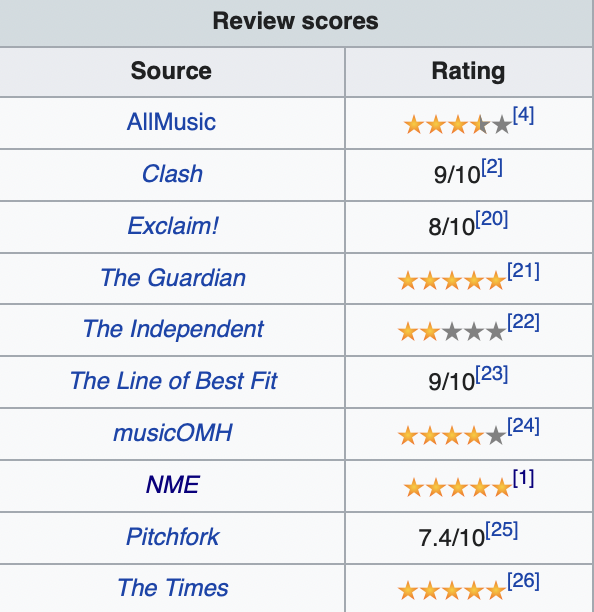

# Proposal

## Research topic

The disconnection between critic reviews and actual sales and streams exists in every area of art.
We are interested in the relationships between **reviews and streams** of top-reviewed/streamed tracks and albums.
Specifically, we consider three dimensions of ranking:

1. Critic reviews: reviews written by professional critics;
2. User ratings: aggregated ratings assigned by general users;
3. Streams: number of streams on streaming services.

Intuitively, music with higher reviews should be streamed more. However, we can see a lot of hit songs with bad reviews, and many highly acclaimed albums that most people have never heard of.

Therefore, exploring and visualizing the relationships between reviews and streams, together with some other dimensions, will give us some insights into how these systems work.
At the application level, the revealed information can help build better recommendation systems, promotion strategies, etc.

## Data availability

We collect data from 4 sources:

- Metacritic for critic reviews
- Rate Your Music for user ratings
- ChartMasters and Spotify for streaming performance

### Critic Reviews

Traditionally, critic reviews are released by publications like magazines and newspapers. [Metacritic](https://metacritic.com) is a famous and reliable website that aggregates reviews of films, TV shows, music albums, etc. As for films, there are several other internet databases that are doing a similar job, like IMDB and Rotten Tomatoes. But when it comes to music, Metacritic is almost the only reliable source of aggregated critic reviews.
What it does is just collect reviews from various publications, and then give an average score.

Metacritic ranks albums according to their review score on its website. For example: [Best Music and Albums for 2020](https://www.metacritic.com/browse/albums/score/metascore/year/filtered?year_selected=2020&distribution=&sort=desc&view=detailed). Metacritic adds new albums to its database several times a week and updates the reviews everyday [^1].

[^1]: [Frequently Asked Questions - Metacritic](https://www.metacritic.com/faq#item29)

The data is presented in an HTML table, so we can easily scrape from their website using the package `rvest`.

Note that we can also scrape the information of a specific album once we know its title. For example, from the album page [Fetch the Bolt Cutters by Fiona Apple Reviews and Tracks](https://www.metacritic.com/music/fetch-the-bolt-cutters).

A sample observation:

| Rank | Title                  | Artist(s)   | Release Date   | Critic Review | User Score |
| ---- | ---------------------- | ----------- | -------------- | ------------- | ---------- |
| 1    | Fetch the Bolt Cutters | Fiona Apple | April 17, 2020 | 98            | 81         |

### User Ratings

Most music review websites like Metacritic and Pitchfork focus on critic reviews. In terms of user ratings, [Rate Your Music (RYM)](https://rateyourmusic.com) is the largest community-driven online music database. For example, the album OK Computer has 83,020 ratings on RYM, while only 654 user ratings on Metacritic.

The ratings on RYM are averaged on user ratings. Like Metacritic, it also ranks albums according to their ratings on its website. For example: [Best albums of 2020 - Rate Your Music](https://rateyourmusic.com/charts/top/album/2020/). RYM updates the charts every week on Tuesdays between 9-10 AM Pacific US time (18:00-19:00 Central European time) [^2].

[^2]: [Charts FAQ - Rate Your Music](https://rateyourmusic.com/wiki/RYM:Charts+FAQ#How%20often%20are%20the%20charts%20updated?)

We use an unofficial Python API, [rymscraper](https://github.com/dbeley/rymscraper), to scrape the data on its website. The scripts will save fetched data in CSV files. Then we can read these CSV files using the function `read.csv()`.

A sample observation:

| Rank | Album    | Artist(s) | Release Date    | Genres  | Rating | \# Ratings | \# Reviews |
| ---- | -------- | --------- | --------------- | ------- | ------ | ---------- | ---------- |
| 4    | One Life | Malibu    | 1 November 2019 | Ambient | 3.63   | 721        | 2          |

### Streams

Today we are in an age of streaming media. Spotify is the world's biggest music streaming platform. However, like other streaming platforms, Spotify does not expose the number of streams to the public. However, its [official APIs](https://developer.spotify.com/documentation/web-api/reference/#/operations/get-track) expose an attribute called `popularity`, which is a value between 0 and 100 based on the number of plays a track has. This feature can reflect the streaming performance of a track. And the popularity of an album can be calculated based on its tracks' popularity. Different features have different data update frequencies. For `popularity`, the data updates every day, but may lag actual popularity by a few days[^3].

[^3]: [Web API Reference | Spotify for Developers](https://developer.spotify.com/documentation/web-api/reference/#/operations/get-track)

We use [spotifyr](https://github.com/charlie86/spotifyr), an R wrapper for Spotify's API, to get data.

An example observation:

| Album            | Average Popularity | Maximum Track Popularity | Summed Popularity |
| ---------------- | ------------------ | ------------------------ | ----------------- |
| Future Nostalgia | 70.63636           | 83                       | 777               |

Another professional website that provides data on streams is [ChartMasters](https://chartmasters.org). It converts the number of streams to equivalent album sales (EAS), updates the data daily, and presents it in HTML tables. Therefore, we can use `rvest` to scrape the data.

However, although ChartMasters is a reputable organization and claims that they collect data directly from official databases like Spotify, we are unable to find the direct source of their data. Therefore, we use data from ChartMasters as additional data to confirm other observations.
